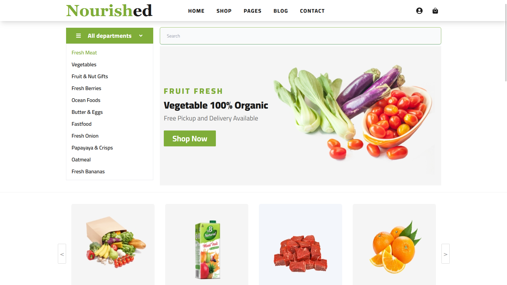
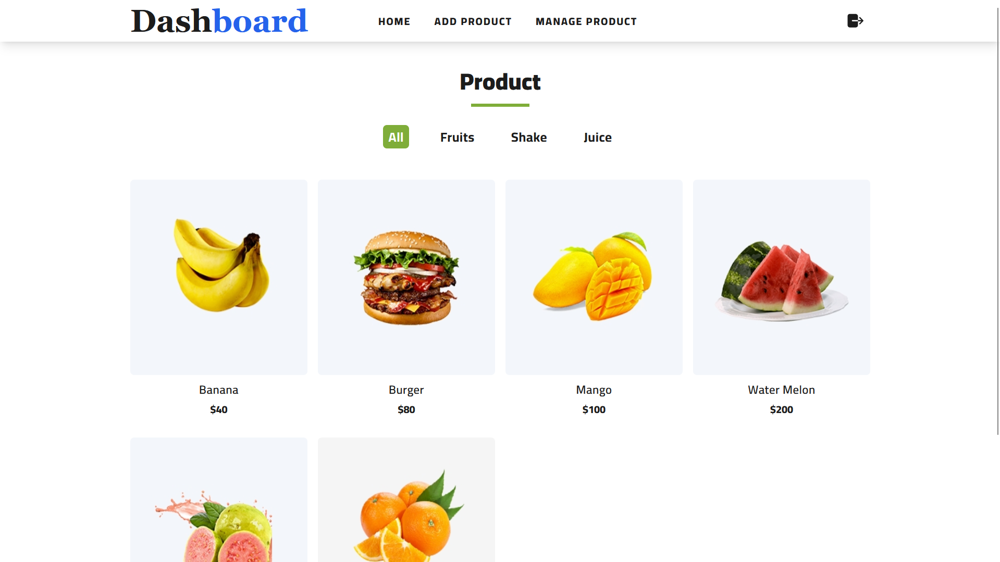
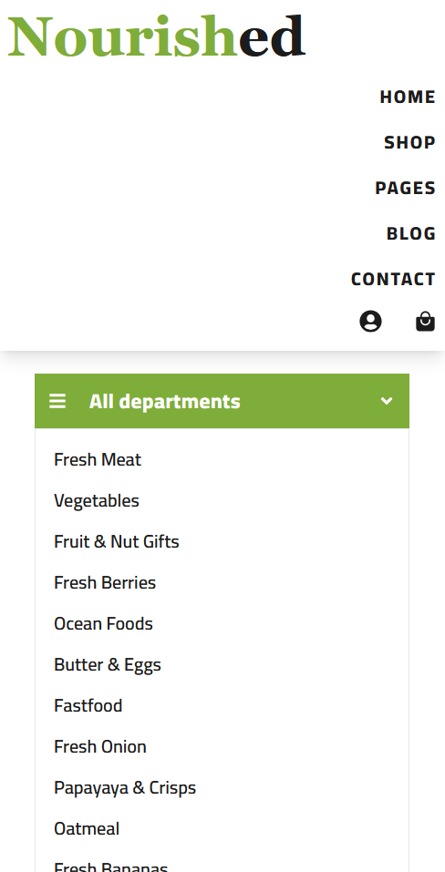
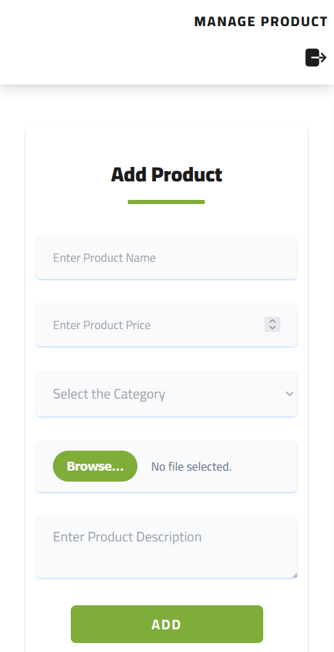

# **NourishedProject**

This project is a feature-rich full-stack web application built with **React (Vite)** for the frontend and **JSON Server** for the backend. The application supports both user and admin roles, with dynamic routing, protected admin functionalities, and efficient state management using Context API. Images are uploaded using **Cloudinary**, and reusable components ensure clean and maintainable code.

---

## **Key Features**

### **User Features**

1. **Dynamic Search and View**:

   - Users can search products by name or category.
   - Search results are displayed in real-time.
   - Clicking on a product navigates to a detailed view page with product-specific information.

2. **Authentication**:

   - Users must log in to access the admin panel.
   - Unauthorized attempts to access the admin panel or protected routes will redirect users to the login page.

3. **Product Details**:

   - Users can view detailed product information, including images, categories, and prices.

4. **Dynamic Category filter change**:
    - you can change category like if you click on shake you see shake category product ot if you click on juice you see juice category product only and all for all category product.

---

### **Admin Features**

1. **Admin Dashboard**:

   - A dedicated panel for managing products, accessible only to authenticated admins.

2. **Add Products**:

   - Admins can add new products to the database.
   - Images are uploaded via **Cloudinary**, with a loader displayed during the upload process.

3. **Manage Products**:

   - A table view displays all products in the database.
   - Actions available:
     - **Edit**: Update product details, including images.
     - **View**: View detailed information about a product.
     - **Delete**: Remove a product from the database.

4. **Protected Routes**:

   - Routes for admin functionality are protected using a `ProtectedRoute` component to ensure proper access control.

5. **Real-Time Updates**:

   - All product changes (add, edit, delete) are reflected dynamically in both the admin panel and user views.

---

## **Project Structure**

Here’s an overview of the folder structure with explanations of key files:

```
nourishedProject/
│
├── db/                  # JSON server folder
│   └── db.json          # Backend JSON file for storing product data
│
├── nourished/          # React project folder
│   ├── public/          # Static assets
│   ├── src/             # Source files
│   │   ├── assets/      # All static images used in the project
│   │   ├── components/  # Reusable and functional components
│   │   │   ├── ui/      # Reusable UI components
│   │   │   │   ├── Input.jsx          # Input field component
│   │   │   │   ├── Button.jsx         # Button component
│   │   │   │   ├── Cards.jsx          # Product cards
│   │   │   │   ├── CategoryFilter.jsx # Product filtering by category
│   │   │   │   ├── HeadingPart.jsx    # Reusable heading for sections
│   │   │   │   ├── ProductList.jsx    # Displays a list of products
│   │   │   │   ├── Search.jsx         # Search bar with suggestions
│   │   │   │   ├── SelectInput.jsx    # Dropdown input component
│   │   │   │   └── TextArea.jsx       # Text area component
│   │   │   ├── dashboard/             # Admin dashboard components
│   │   │   │   ├── AddProducts.jsx    # Add new products
│   │   │   │   ├── DashboardHome.jsx  # Admin dashboard home
│   │   │   │   ├── DashboardNavbar.jsx# Navbar for admin panel
│   │   │   │   ├── EditProduct.jsx    # Edit existing products
│   │   │   │   ├── ManageProducts.jsx # Table of products with actions
│   │   │   │   └── View.jsx           # View product details
│   │   │   └── ProtectedRoute.jsx     # Protects admin routes
│   │   ├── context/                   # Context API for state management
│   │   │   ├── AdminProvider.jsx      # Manages admin state (user/admin)
│   │   │   └── DataProvider.jsx       # Fetches and provides product data
│   │   ├── data/                      # Static data and initial arrays
│   │   │   └── productData.js         # Array of products and metadata
│   │   ├── pages/                     # Pages for the application
│   │   │   ├── Banner.jsx             # Banner section on the home page
│   │   │   ├── Blog.jsx               # Blog page for articles or updates
│   │   │   ├── Categories.jsx         # Categories section for products
│   │   │   ├── Features.jsx           # Highlights app features
│   │   │   ├── Hero.jsx               # Hero section for home page
│   │   │   ├── Home.jsx               # Main landing page
│   │   │   ├── Login.jsx              # Login page for admin access
│   │   │   └── Navbar.jsx             # Navigation bar for users
│   │   ├── service.js                 # API services for Cloudinary and products
│   │   └── App.jsx                    # Main app component with routing
│   ├── index.html                     # Entry HTML file
│   └── vite.config.js                 # Vite configuration
```

---

## **Dependencies**

This project uses the following npm packages:

- **axios**: For making HTTP requests.
- **json-server**: For creating a mock backend server.
- **react**: For building the user interface.
- **react-dom**: For rendering React components.
- **react-icons**: For using icon components in the application.
- **react-loader-spinner**: For displaying loading spinners during asynchronous operations.
- **react-router-dom**: For handling routing in the application.
- **react-slick**: For creating carousels and sliders.
- **slick-carousel**: A dependency for styling React Slick components.

---

## **ScreenShot of Project**

- **DesktopView**:

- **User**:



- **Admin**:


  
- **MobileView**:






## **How to Run the Project**

### **Prerequisites**

- **Node.js** installed
- **JSON Server** installed globally:
  ```bash
  npm install -g json-server
  ```

---

### **Steps**

#### 1. **Run the JSON Server**

- Navigate to the `db` folder and start the JSON server:
  ```bash
  cd db
  npx json-server db.json
  ```

#### 2. **Start the React App**

- Navigate to the `nourished` folder:
  ```bash
  cd nourished
  npm install
  npm run dev
  ```

#### 3. **Access the Application**

- React App: `http://localhost:5173` (default Vite port)
- JSON Server: `http://localhost:3000`

---

## **State Management**

1. **AdminProvider**:

   - Provides admin state (determines if the user is an admin or not).
   - Protects routes based on user roles.

2. **DataProvider**:

   - Fetches product data from `db.json`.
   - Shares product data across components using Context API.

---

## **Backend Integration**

- **JSON Server**: Used as the mock backend for product data storage.
- **Cloudinary**: For image uploads when adding or editing products.

---

## **Future Enhancements**

1. Implement JWT-based authentication for secure login.
2. Add pagination for product lists in the admin dashboard.
3. Improve UI with advanced design frameworks.
4. Deploy the project using platforms like Netlify or Vercel.


